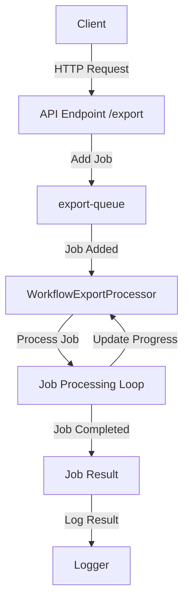

# Nest TypeScript Starter

This is a starter repository for building applications using NestJS with TypeScript. It includes a sample workflow export module that demonstrates how to use BullMQ for job processing.

## Description

The project is structured to provide a clean and organized starting point for developing NestJS applications. It includes essential configurations and dependencies to get you up and running quickly.

## Installation

To install the dependencies, you need to have `pnpm` installed. If you don't have `pnpm` installed, you can install it globally using npm:
```bash
npm install -g pnpm
```

Then, install the dependencies:
```bash
pnpm install
```

**Note:** A working Redis instance is required at `localhost:6379` for job processing with BullMQ.

## Running the application

To start the application, run the following command:
```bash
pnpm start
```

## Testing the workflow export

To test the workflow export, you can use the following command:
```bash
curl http://localhost:3000/export
```
This will return the job details, including the job ID.

To get the job details, you can use the following command:
```bash
curl http://localhost:3000/job/{jobId}
```

This will add a job to the `export-queue` and the job will be processed by the `WorkflowExportProcessor`.

## BullMQ Job Processing Diagram



